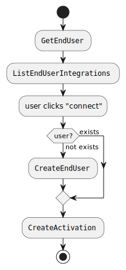

This introduction includes high-level instructions on building the front-end component of your integration hub within
your own application.

## Choosing your embedded implementation

Before continuing, it's worth understanding two approaches to building your integration hub.

### Full Client-Side

In this approach, your integration hub is built entirely in the client-side code of your application. This is the
simplest (and quickest) way to get started for most applications, however some users may prefer implementing some
server-side logic to facilitate the integration hub, in which case the hybrid approach is available.

#### Authentication

When using the fully client-side approach, you will need to authenticate your users against Versori APIs using [Signing
Key][signing-keys] tokens.

<Warning>
    You should never use [API Keys][api-keys] with the full client-side approach. These keys have full access to your
    organisation and should not be exposed to your users in any way.

    Nor should you expose your Signing Key to your users. This key should be kept secure and only used in your
    server-side code to issue JWT tokens.

</Warning>

This approach involves implementing a new API endpoint in your own application which can authenticate your end user and
issue a JWT token signed with a [Signing Key][signing-keys]. This token can then be used to authenticate your user
against Versori APIs, and they will only have access to manage their own activations to your integration hub.

<Info>
    We are working on providing reference implementations for this endpoint in multiple languages/frameworks. If you
    would like to discuss this further, please reach out to us.
</Info>

### Hybrid Client-Side and Server-Side

In this approach, your integration hub is built using a combination of client-side and server-side code. This allows you
to pick and choose which parts of the integration hub are built in the client-side versus the server-side to suit your
application's requirements.

#### Authentication

If communicating with Versori APIs from your server-side code, you can use [API Keys][api-keys] or [Signing
Key][signing-keys] tokens, but it is your responsibility to authenticate requests at your own API boundary. However, as
with the full client-side approach, if there are any components on the client-side which need to communicate with
Versori APIs, you should use [Signing Key][signing-keys] tokens.

## Pre-requisites

Before building your integration hub, you will need to have the following:

-   A Hub created in the Versori platform, and its identifier (denoted by its `id` field).
-   At least one deployed Integration created in the Versori platform.
-   Chosen an implementation method covered [above](#choosing-your-embedded-implementation).

## Build

### Identifying your End Users

The first step in building your integration hub is deciding how to identify your end users. We recommend using the same
unique identifier used in your own application, however this is not mandatory. At a minimum it should be unique and
immutable; an email address is not recommended.

### Understanding the activation process

This section provides step-by-step instructions for activating an integration for one of your end users.

<Accordion title="Activation Diagram">
    The diagram below outlines the process of activating an integration for one of your end users:

    <Frame>
        
    </Frame>

</Accordion>

<Steps>
    <Step title="Get End User">
        You can use the [Get End User][get-end-user] API endpoint to retrieve an End User associated with your
        Hub. This will respond with a 404 if the user does not exist in your Hub yet.
    </Step>

    <Step title="List Integrations">
        The [List End User Integrations][list-end-user-integrations] API endpoint can be used to retrieve a paginated
        list of integrations available to your hub.

        The response includes whether the integration is deployed, and if the user has already activated the
        integration. This enables you to render the correct UI elements against each integration.

        <Note>
            You can provide filters to this endpoint to customise which integrations are returned, for example you can
            hide integrations not deployed, or only include integrations which are connected or not connected.
        </Note>
    </Step>

    <Step title="User Activates Integration">
        When the End User chooses to activate an Integration, the configuration for each Connection Template must be
        collected; at a minimum this includes the credentials for the End User, but also any additional Connection
        Variables which may be required. This information may be collected through manual input via a form, an OAuth
        2.0 flow, or some other method implemented by you. The only exception to this are the credentials for the
        Primary Connector, for which a Connection should already exist for the current End User.

        <Note>
            At this point, if the End User does not already exist, the [Create End User][create-end-user] API should
            be called to create the End User in your Hub.
        </Note>

        Once the configuration for each Connection Template is collected the penultimate step, if applicable, is to
        configure any Integration Variables. These are variables which are specific to the integration and allow
        configuring specific behaviour per activation.

        Finally, the [Activate Integration][activate-integration] API should be called to create the activation for the
        End User.
    </Step>

</Steps>

[signing-keys]: /v1/api-reference/authentication#signing-keys
[api-keys]: /v1/api-reference/authentication#api-keys
[get-end-user]: /v1/api-reference/embedded-api/end-users/retrieve-an-end-user
[list-end-user-integrations]: /v1/api-reference/embedded-api/embedded/list-end-user-integrations
[create-end-user]: /v1/api-reference/embedded-api/end-users/create-an-end-user
[activate-integration]: /v1/api-reference/embedded-api/activations/activate-integration
